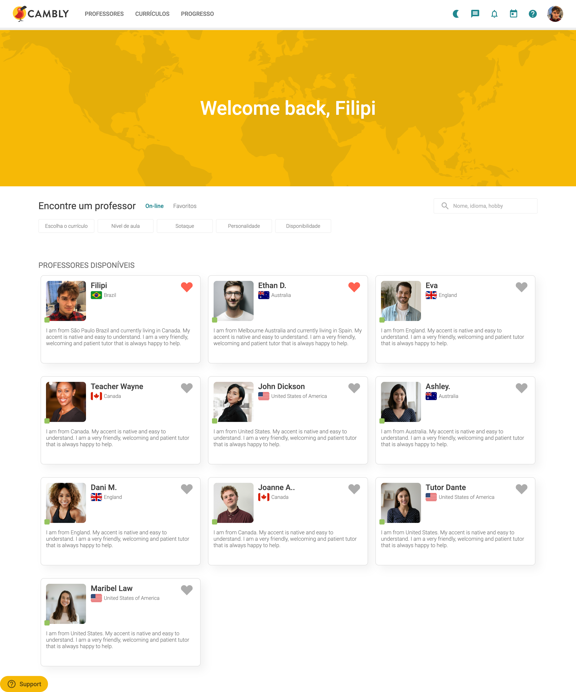
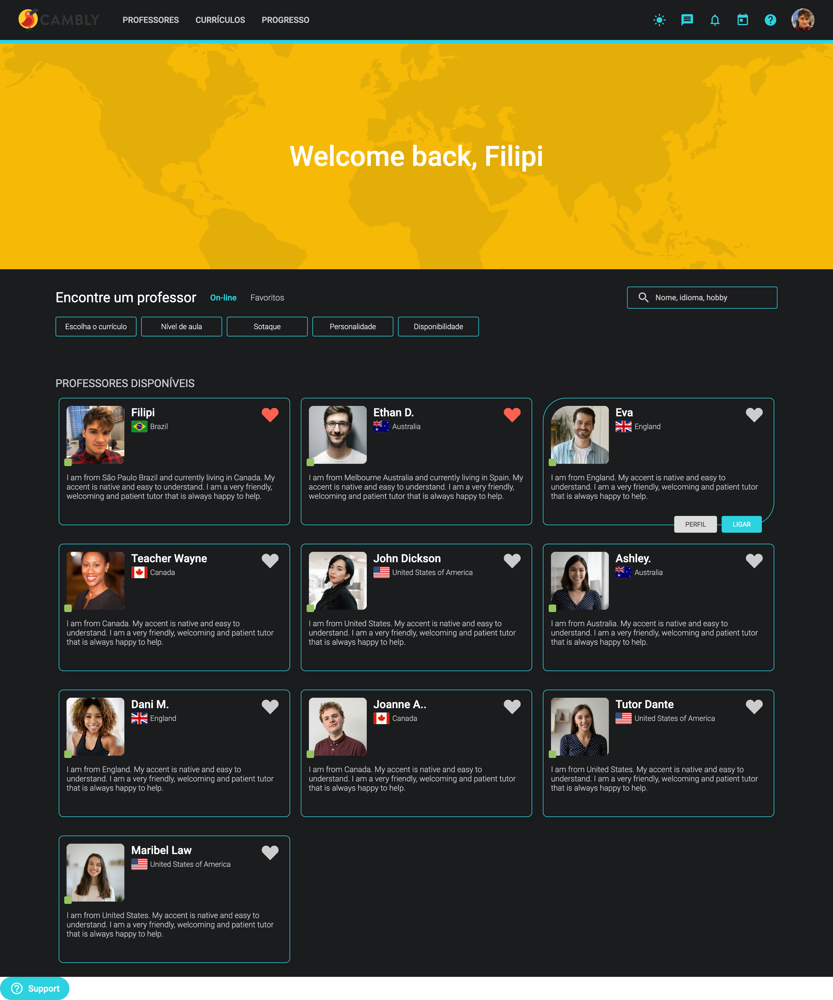

## 🚀 Sobre o Projeto
A ideia do projeto foi para aplicar, práticar e melhorar minhas habilidades técnicas em desenvolvimento web com React, Typescript, styled-components e mais tecnologias que envolvendo a concepção, desenvolvimento e entrega do produto.

## 💡 Ideia
O projeto tem o objetivo final de ser um clone UI do Cambly, mas com um novo design.

## 🚀 Live Preview
Acesse o projeto: [Live Preview](https://cambly-ui-clone.vercel.app/)

## 🚀 Novas versões
Conforme vou adquirindo novas habilidades, irei atualizando o projeto em novas versões. 

## 🚀 Tecnologias utilizadas
- React com Typescript
- Styled Components
- React Router DOM
- Animate.css
- Vercel

##

# Doing.dev

O projeto tem o objetivo final de ser um clone UI do Cambly, mas com um novo design.

| :placard: Vitrine.Dev |     |
| -------------  | --- |
| :sparkles: Nome        | **Cambly UI Clone**
| :label: Tecnologias | Typescript, React, Styled-components, Animate.css, Vercel (tecnologias utilizadas)
| :rocket: URL         | https://cambly-ui-clone.vercel.app/
| :fire: Desafio     | https://github.com/FilipiRafael/cambly-ui-clone

<!-- Inserir imagem com a #vitrinedev ao final do link -->

## Detalhes do projeto

A ideia do projeto foi para aplicar, práticar e melhorar minhas habilidades técnicas em desenvolvimento web com React, Typescript, styled-components e mais tecnologias que envolvendo a concepção, desenvolvimento e entrega do produto.
